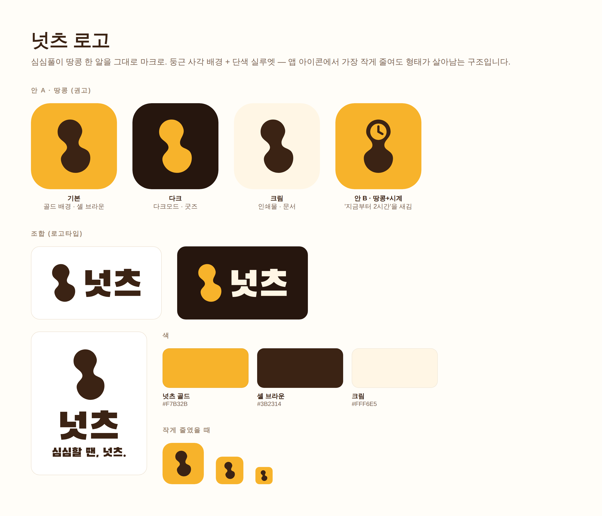

# 넛츠 로고

심심풀이 땅콩 한 알을 그대로 마크로 썼습니다. **둥근 사각 배경 + 단색 실루엣** 구조라
앱 아이콘에서 가장 작게 줄여도 형태가 살아남습니다.

## 안 두 가지

| | 마크 | 쓰임 |
|---|---|---|
| **안 A · 땅콩** (권고) | 땅콩 실루엣만 | 기본. 설명이 필요 없고 가장 작은 크기까지 버팁니다 |
| 안 B · 땅콩+시계 | 윗 로브를 파내 시계판 | '지금부터 2시간'을 아이콘 안에 넣고 싶을 때 |

안 A를 권고합니다. 시계를 넣으면 뜻은 늘지만 16px에서 다이얼이 뭉갭니다.
안 B는 스플래시·포스터 등 크게 쓰는 자리에서만 쓰십시오.

## 색

| 이름 | HEX | 쓰임 |
|---|---|---|
| 넛츠 골드 | `#F7B32B` | 아이콘 배경, 포인트 |
| 셸 브라운 | `#3B2314` | 마크, 로고타입, 본문 |
| 크림 | `#FFF6E5` | 밝은 배경, 다크 배경 위 글자 |
| 잉크 | `#26160E` | 다크 배경 |

당근의 주황(#FF6F0F)과 겹치지 않도록 **골드 쪽으로 내렸고**, 마크는 흰색이 아니라
**브라운 실루엣**이라 나란히 놓아도 구분됩니다.

## 파일

| 파일 | 용도 |
|---|---|
| `nuts-appicon.svg` / `-1024.png` | 앱 아이콘 기본 (골드 배경) |
| `nuts-appicon-dark.svg` / `-1024.png` | 다크모드 · 굿즈 |
| `nuts-appicon-cream.svg` / `-1024.png` | 인쇄물 · 문서 |
| `nuts-appicon-clock.svg` / `-1024.png` | 안 B (땅콩+시계) |
| `nuts-mark.svg` · `-gold` · `-mono-black` · `-mono-white` | 마크만 (배경 투명) |
| `nuts-logo-horizontal.svg` / `.png` | 가로 조합 (마크 + 넛츠) |
| `nuts-logo-horizontal-gold.svg` | 가로 조합 · 어두운 배경용 |
| `nuts-logo-vertical.svg` / `.png` | 세로 조합 + 슬로건 |
| `nuts-logo-sheet.png` | 위 전체를 한 장에 모은 시트 |

## 쓸 때 지킬 것

- **마크 주위 여백**은 마크 높이의 1/4 이상 비웁니다.
- 마크를 **늘이거나 기울기를 바꾸지 않습니다.** 기울기 -12°가 원본입니다.
- 배경색 위에 놓을 때는 `nuts-mark-mono-white.svg` / `-black` 을 쓰고, 골드 위에 골드 마크는 금지입니다.
- 로고타입은 **아웃라인(패스)** 으로 들어 있어 폰트가 없는 PC에서도 동일하게 보입니다.

## 만든 방식

- 마크: 베지에로 직접 그린 오리지널 도형 (`build.js`)
- 로고타입 글꼴: **Black Han Sans** (SIL Open Font License 1.1) — 글자를 패스로 변환해 넣었습니다
- `npm run build:logo` 로 SVG 전체를 다시 생성합니다 (문구·색만 고치면 됩니다)
- PNG·시트는 `node brand/render.js`, `node brand/sheet.js` — playwright 가 설치돼 있어야 합니다
